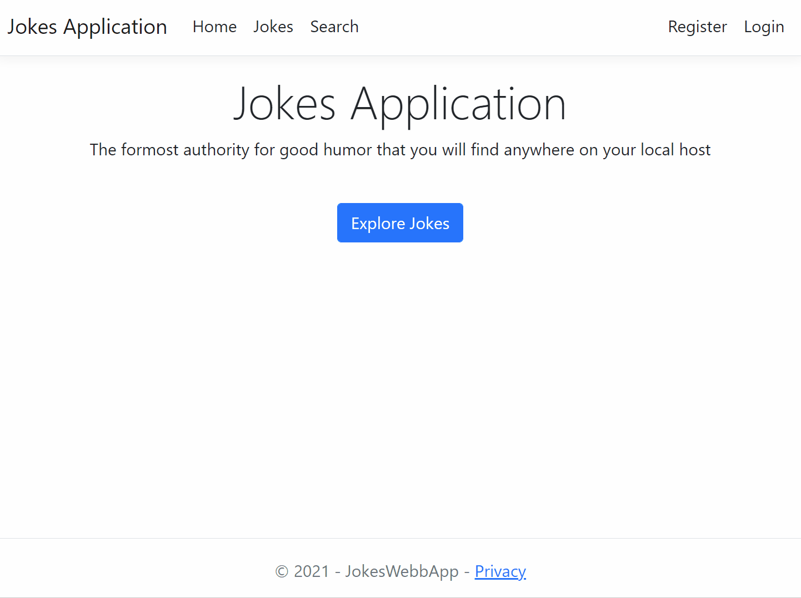

# Jokes Web App
This project is a CRUD web application built with ASP.NET Core. The user can can login or make an account to add a joke to the database. If the user does not wish to login, they can still view the jokes that were published.

## What I learned
* How to use the MVC (Model View Controller) design pattern
* Configure database tables using the Entity framework
* Set up classes as models
* Set up authorization
* Customize Razor forms
* Use Bootstrap classes
* Create a search function to filter databse results
